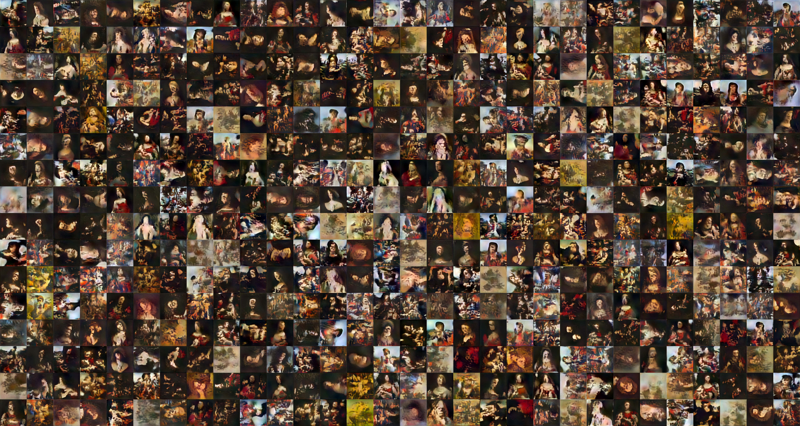
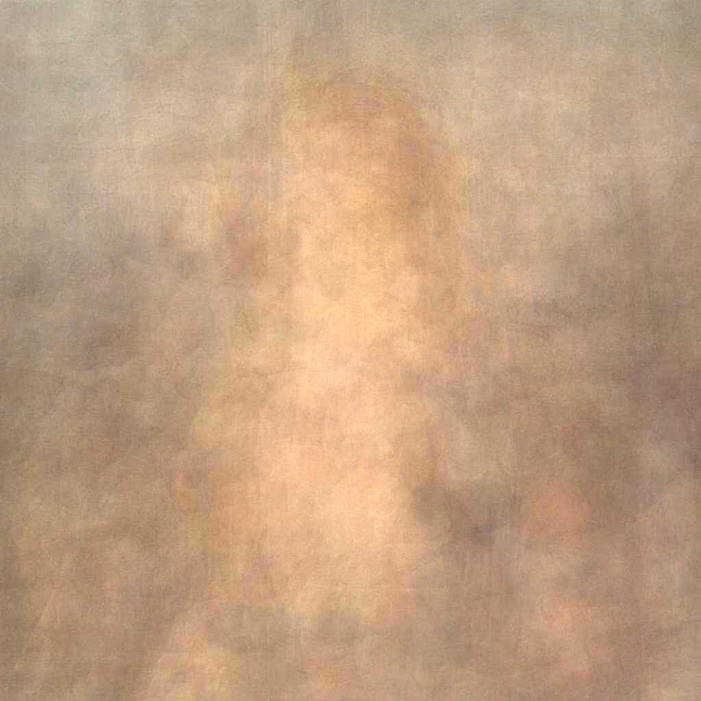

# LeonardoGAN
A Leonardeschi Generative Adversarial Network for paintings. 
LeonardoGAN; a StyleGan2 model for Leonardo da Vinci and paintings Leonardeschi.

1. LeonardoGAN grid of 480 256x256 pixel fake paintings.


LeonardoGAN is a StyleGAN2 generative adversarial  network trained on an augented dataset of 225 Leonardeschi paintings. LeonardoGAN, through StyleGAN2, offers the possibility generating a very large synthetic database of Leonardeschi paintings.

# Requirements

The aim of this work is to support easy access through Google Colab.  The notebook LeonardoGAN.ipynb in the LeonardoGAN _StyleGan2 folder provides access to LeonardoGAN. The following requirements are derived from StyleGAN2 requirements:  

Both Linux and Windows are supported.
Linux is recommended for performance and compatibility reasons.
64-bit Python 3.6 installation. 
Anaconda3 with numpy 1.14.3 or newer.
TensorFlow 1.14 or 1.15 with GPU support. 
The code does not support TensorFlow 2.0.
On Windows, you need to use TensorFlow 1.14 — TensorFlow 1.15 will not work.
One or more high-end NVIDIA GPUs, NVIDIA drivers, CUDA 10.0 toolkit and cuDNN 7.5. 
To reproduce the results reported in the paper StyleGAN2, you need an NVIDIA GPU with at least 16 GB of DRAM.
Docker users: use the provided StyleGAN2 Dockerfile to build an image with the required library dependencies.

For more information visit: https://github.com/NVlabs/stylegan2.

# Dataset 

225 1024X1024  have been cleaned for compatibility with StyleGAN2, see above image. All images have been cropped to person centre and rescaled to 256x256, 512x512 and 1024x1024. 

4. The average 1024x1024 Leonardeschi painting. 


The average 1024x1024 Leonardeschi painting reveals the primary position of figures. 

# Colab
The following notebook LeonardoGAN.ipynb run on Colab provides access to the LeonardoGAN.  Download LeonardoGAN_StyleGan2, unzip and upload to Google Drive. Open LeonardoGAN.ipynb with Google Colab. Select Runtime, Change runtime type and set the Runtime type to Python 3 and the Hardware accelerator to GPU. Then Run all. 

You may need to modify some paths, e.g:  
self.tfrecord_dir       = './my_tfrecord_dir' in dataset.py. 

# Pretrained model
The most recent pretrained model for the dataset can be found in the 00008-stylegan2-LeonardoGAN-1gpu-config-f folder in the shared Google Drive folder at the following: 
https://drive.google.com/drive/folders/1Bml9tB45MdzIDbxqxkVtJDvkkBtQBVJk?usp=sharing


# Contact
George Cann, Department of Space and Climate Physics (Mullard Space Science Laboratory), University College London.
Email: george.cann.15@ucl.ac.uk. 


# Citation
```
1. George Cann
LeonardoGAN, (2020)
https://github.com/ghcann/LeonardoGAN
```

```
@article{cann_leonardo-gan,
  title={LeonardoGAN},
  author={George Cann},
  journal={arXiv TBC},
  url={https://github.com/ghcann/LeonardoGAN},
  year={2020}
}
```

```
2. Tero Karras, Samuli Laine, Miika Aittala, Janne Hellsten, Jaakko Lehtinen, Timo Aila
Analyzing and Improving the Image Quality of StyleGAN
https://github.com/NVlabs/stylegan2
```

```
@article{Karras2019stylegan2,
  title   = {Analyzing and Improving the Image Quality of {StyleGAN}},
  author  = {Tero Karras and Samuli Laine and Miika Aittala and Janne Hellsten and Jaakko Lehtinen and Timo Aila},
  journal = {CoRR},
  volume  = {abs/1912.04958},
  year    = {2019},
}
```

# Acknowledgements

The author would like to thank NVlabs, Tero Karras, Samuli Laine, Miika Aittala, Janne Hellsten, Jaakko Lehtinen, Timo Aila for providing StyleGan2 (https://github.com/NVlabs/stylegan2). 
